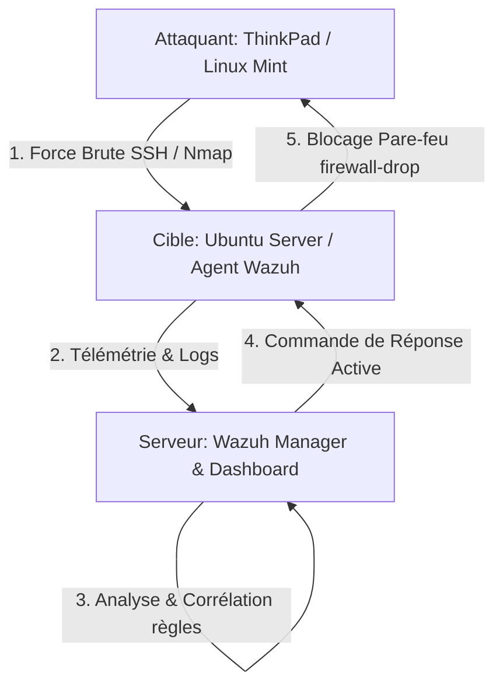

# Rapport de Projet SOC/SIEM : Déploiement de Wazuh & Automatisation de la Réponse aux Incidents (SOAR)

**Auteur :** Anass Es-Saghir  
**Formation :** Cycle Ingénieur ISIC – ENSA El Jadida  
**Date :** Juillet 2026  
**Rôle visé :** Ingénieur Cybersécurité / Analyste SOC L2 / Ingénieur DevSecOps  

---

## 1. Résumé Exécutif (Executive Summary)

Ce projet pratique formalise la conception, le déploiement et la validation d'une infrastructure de surveillance et de réponse automatisée basée sur la solution open-source **Wazuh SIEM/SOAR**. Dans un contexte où les entreprises (notamment les industries manufacturières, logistiques et de la mode, fortement dépendantes de leur chaîne logistique numérique) subissent une hausse des cyberattaques, la centralisation des logs et la réponse active sont devenues indispensables. 

Ce laboratoire démontre une approche de **Défense en Profondeur** structurée en trois phases clés :
1. **Détection Passive :** Identification en temps réel d'une attaque par force brute SSH (via Hydra) et analyse des limites d'un SIEM passif.
2. **Défense Active (SOAR) :** Automatisation du blocage réseau (Active Response) via le déploiement dynamique de règles de pare-feu (`firewall-drop`).
3. **Surveillance Interne & Zero Trust :** Audit comportemental et détection de tentatives d'élévation de privilèges locaux (abris de `sudo`).



---

## 2. Contexte Industriel et Alignement Réglementaire

L'intégration de solutions SIEM/SOAR ne répond pas seulement à un défi technique, mais s'inscrit dans une démarche globale de gestion des risques métiers et de conformité réglementaire. 

### 2.1 Enjeux pour l'Industrie et la Supply Chain
Inspiré des modélisations de sécurité appliquées aux industries à flux tendus (comme l'industrie textile et de l'habillement), ce projet répond à plusieurs vulnérabilités critiques :
* **Protection des systèmes ERP et d'approvisionnement :** Blocage des intrusions ciblées visant à exfiltrer des bases de données de commandes ou de facturation.
* **Continuité d'activité (BCP) :** Neutralisation immédiate des attaques de force brute pour éviter le déni de service (DoS) sur les serveurs de production.

### 2.2 Alignement avec les Frameworks de Conformité
Le déploiement mis en œuvre dans ce projet permet de valider plusieurs contrôles majeurs des standards internationaux :
* **CIS Controls (v8) :** Notamment le *Contrôle 8 (Audit Log Management)* et le *Contrôle 4 (Secure Configuration of Enterprise Assets)*.
* **RGPD (GDPR) :** Articles 32 et 33 relatifs à la sécurité du traitement et à la notification rapide des violations de données.
* **PCI-DSS (v4.0) :** Exigence 10 (Surveillance et suivi de tous les accès aux ressources réseau et aux données des titulaires de carte).

---

## 3. Architecture Technique de la Plateforme (Lab Setup)

Le laboratoire a été entièrement virtualisé au sein d'un hyperviseur de type 1/2 sous Linux pour garantir une isolation réseau stricte tout en reproduisant une topologie d'entreprise réaliste.

### 3.1 Détails de l'Environnement de Laboratoire

| Entité | Système d'Exploitation | Rôle / Outils installés | Adresse IP |
| :--- | :--- | :--- | :--- |
| **Machine Hôte (Attaquant)** | Linux Mint (ThinkPad Host) | Hydra v9.5, Nmap 7.94 | `192.168.100.1` |
| **Passerelle / Hyperviseur** | KVM / QEMU | Hyperviseur & Routage NAT | `192.168.100.0/24` |
| **Serveur SIEM/SOAR** | Linux Server (Debian/CentOS) | Wazuh Manager v4.x, Wazuh Dashboard | `192.168.100.246` |
| **Target Endpoint** | Ubuntu Server 24.04 LTS | Agent Wazuh v4.x, Service SSH | `192.168.100.230` |

### 3.2 Diagramme Réseau Logique
Le diagramme suivant détaille les flux d'attaque et de télémétrie établis entre l'attaquant, la cible et le serveur de sécurité :


*Figure 1 : Topologie réseau du laboratoire isolé sous KVM/QEMU.*

---

## 4. Phase 1 : Reconnaissance, Attaque Initiale et Détection Passive

L'objectif de cette phase est de simuler une intrusion externe réaliste et d'analyser la visibilité offerte par un SIEM configuré en mode d'écoute pure (sans réponse active).

### 4.1 Phase de Reconnaissance & Scan de Vulnérabilités
Depuis la machine hôte attaquante (`192.168.100.1`), un scan de ports agressif et une détection d'OS ont été exécutés avec **Nmap** :

```bash
ae6@thinkpad:~$ sudo nmap -sV -O -F 192.168.100.230
```


Le scan révèle que le port SSH standard (`22/tcp`) est ouvert et utilise le démon OpenSSH 9.6p1 sur une distribution Ubuntu Linux (noyau 4.x/5.x).

### 4.2 Simulation de l'Intrusion (Force Brute SSH)
Afin d'obtenir un accès initial, une attaque par dictionnaire a été lancée contre l'utilisateur `ut` de la cible avec **Hydra** :

```bash
ae6@thinkpad:~$ hydra -l ut -P test_passwords.txt ssh://192.168.100.230 -t 4
```


*Figure 2 : Exécution de l'outil de scan réseau Nmap et de l'attaque par dictionnaire Hydra depuis la machine attaquante.*

### 4.3 Analyse de la Détection Passive dans Wazuh
À ce stade, l'agent Wazuh transmet les journaux de sécurité (`auth.log`) au Manager. Le tableau de bord *Threat Hunting* remonte bien les alertes de force brute :

* **Alerte critique détectée :** Règle `5763` - *sshd: brute force trying to get access to the system. Authentication failed.* (Niveau de sévérité : **10**)
* **Alertes secondaires :** Règle `2502` - *syslog: User missed the password more than one time* (Niveau de sévérité : **10**)


*Figure 3 : Vue globale des alertes de force brute SSH consolidées sur le tableau de bord de Threat Hunting de Wazuh.*

#### Détails XML/JSON d'un Événement de Détection SSH :
La capture d'écran ci-dessous illustre la structure riche des métadonnées extraites par le décodeur `sshd` de Wazuh, identifiant formellement l'adresse IP source de l'attaquant (`192.168.100.1`) et le compte ciblé (`ut`).


*Figure 4 : Fenêtre de détails d'événement (Document Details) affichant le log brut PAM et les variables décodées dans le SIEM.*

> [!WARNING]
> **Le Constat de Vulnérabilité :** En mode passif, bien que l'analyste SOC visualise l'alerte sur sa console, le système n'intervient pas. L'attaquant a pu poursuivre son attaque et finir par se connecter avec succès via SSH (`ssh ut@192.168.100.230`), soulignant l'importance critique d'une couche d'automatisation SOAR.

---

## 5. Phase 2 : Configuration de la Réponse Active (SOAR)

Pour combler l'écart de sécurité identifié lors de la Phase 1, un mécanisme de blocage dynamique a été configuré pour couper automatiquement l'accès réseau de toute source malveillante récurrente.

### 5.1 Armement de la Réponse Active sur l'Agent Cible
Sur la machine cible (`ubuntu-target`), nous avons modifié le fichier de configuration de l'agent `/var/ossec/etc/ossec.conf` afin d'autoriser l'exécution de commandes système envoyées par le manager.

```xml
<!-- Extrait du fichier /var/ossec/etc/ossec.conf sur l'Agent -->
<active-response>
  <disabled>no</disabled>
</active-response>
```

### 5.2 Déclaration et Corrélation sur le Manager (Serveur Wazuh)
Sur le serveur Wazuh Manager, nous avons défini l'action à mener et sa condition de déclenchement dans `/var/ossec/etc/ossec.conf` :

1. **Définition de la Commande (Action) :**  
   Association de la commande système à exécuter (le script par défaut `firewall-drop` qui interagit avec `iptables` ou `nftables`).
2. **Configuration du Déclencheur (Active Response) :**  
   Lancement de l'action `firewall-drop` pendant une durée temporaire de **300 secondes** (5 minutes) dès lors qu'une alerte liée à la règle `5763` (Brute Force SSH) est émise.

```xml
<!-- Extrait de la configuration /var/ossec/etc/ossec.conf sur le Manager -->

<!-- 1. Définition de l'action système -->
<command>
  <name>firewall-drop</name>
  <executable>firewall-drop</executable>
  <expect>srcip</expect>
  <timeout_allowed>yes</timeout_allowed>
</command>

<!-- 2. Corrélation règle/action -->
<active_response>
  <command>firewall-drop</command>
  <location>local</location>
  <rules_id>5763</rules_id>
  <timeout>300</timeout>
</active_response>
```

### 5.3 Validation Opérationnelle
Après redémarrage du service Wazuh Manager, la validation du chargement mémoire de la configuration a été confirmée à l'aide de l'utilitaire d'administration `agent_control` :

```bash
[wazuh-user@wazuh-server ~]$ sudo /var/ossec/bin/agent_control -b 192.168.100.1 -f firewall-drop300 -u 001
```


*Figure 5 : Console d'administration du manager validant le déclenchement forcé du blocage de l'IP attaquante sur l'agent ID 001.*

### 5.4 Test d'Efficacité du Blocage SOAR
Dès que l'attaque par force brute SSH a de nouveau été initiée depuis la machine attaquante (`192.168.100.1`), la règle active s'est déclenchée instantanément. Une tentative immédiate de reconnexion SSH manuelle par l'attaquant a échoué en timeout :

```bash
ae6@thinkpad:~$ ssh ut@192.168.100.230
ssh: connect to host 192.168.100.230 port 22: Connection timed out
```


*Figure 6 : Terminal de l'attaquant montrant le rejet silencieux des paquets TCP (Drop) provoquant un dépassement de délai SSH.*

---

## 6. Phase 3 : Surveillance Interne, Privilèges et Zero Trust (Menace Interne)

La sécurisation du périmètre réseau externe ne suffit pas. Dans un modèle de sécurité **Zero Trust**, tout utilisateur interne ou service compromis doit être surveillé en permanence. Cette phase simule et détecte une tentative d'élévation de privilèges locaux.

### 6.1 Simulation de l'Abus de Privilèges
Pour simuler un utilisateur interne malveillant (ou un compte stagiaire compromis par ingénierie sociale), un utilisateur standard nommé `stagiaire` a été créé sur l'agent Ubuntu :

```bash
ut@ubuntu-target:~$ sudo useradd -m -s /bin/bash stagiaire
ut@ubuntu-target:~$ sudo su - stagiaire
```

Une fois connecté, l'utilisateur a tenté d'accéder au fichier contenant les empreintes de mots de passe (`/etc/shadow`), opération strictement réservée aux administrateurs root. Il a forcé l'appel à la commande `sudo` en saisissant de faux mots de passe à plusieurs reprises :

```bash
stagiaire@ubuntu-target:~$ sudo cat /etc/shadow
```


*Figure 7 : Terminal de l'agent illustrant la création du profil restreint et la levée d'erreurs d'authentification lors de l'accès à /etc/shadow.*

### 6.2 Corrélation et Analyse SOC dans le SIEM
Le démon `PAM` de la machine cible a rejeté les tentatives d'accès et journalisé l'anomalie dans `/var/log/auth.log`. L'agent Wazuh a immédiatement transmis ces logs de sécurité.

Sur le tableau de bord *Threat Hunting*, l'analyste SOC observe le pic d'événements et identifie précisément les alertes suivantes :
* **Alerte critique :** Règle `5405` - *Unauthorized user attempted to use sudo.* (Niveau de sévérité : **5**)
* **Alerte PAM :** Règle `5503` - *PAM: User login failed.* (Niveau de sévérité : **5**)


*Figure 8 : Graphique temporel et logs détaillés affichant la détection en temps réel des tentatives d'élévation de privilèges locaux.*

---

## 7. Consolidation des Contrôles & Complétude (Apport de la Recherche)

En exploitant les travaux académiques sur l'implémentation de Wazuh au sein de secteurs industriels sensibles (tels que la supply chain textile), nous pouvons extrapoler les capacités de la plateforme pour couvrir d'autres menaces critiques.

### 7.1 Intégrité des Fichiers Sensibles (FIM - File Integrity Monitoring)
Bien que non simulée directement dans ce lab, la surveillance d'intégrité (module *Syscheck* de Wazuh) est indispensable pour se prémunir contre la modification de fichiers de configuration ou le dépôt de web shells. Le comportement attendu de Wazuh (détaillé dans la recherche) est résumé ci-dessous :

| Chemin du Fichier Audité | Événement Détecté | Impact Sécurité / Description | Count |
| :--- | :--- | :--- | :--- |
| `c:\source_code1\new text document.txt` | File added | Détection d'un nouveau fichier suspect dans les répertoires applicatifs. | 1 |
| `c:\source_code1\new text document.txt` | File deleted | Suppression inattendue d'un fichier source critique. | 1 |
| `c:\source_code1\new text document.txt` | Integrity checksum changed | Modification furtive d'un script ou binaire (changement de hash SHA-256). | 1 |
| `c:\source_code2\new_file.txt` | File added | Injection de code tiers dans un répertoire de production. | 1 |

### 7.2 Évaluation de la Posture de Sécurité (SCA - Security Configuration Assessment)
Wazuh intègre nativement un moteur d'audit de configuration basé sur les recommandations du **CIS (Center for Internet Security)**. Lors de la phase de surveillance, plusieurs dizaines d'échecs de conformité sur l'agent (comme l'activation d'authentifications obsolètes, règles d'audit manquantes, permissions incorrectes sur `/etc/security/opasswd`) ont été générés automatiques sous la règle `19007` (niveau 7), offrant une feuille de route claire pour le durcissement (hardening) de l'OS.

---

## 8. Conclusion et Perspectives d'Évolution

L'infrastructure SOC déployée durant ce projet démontre la puissance et la maturité des outils de détection open-source. En combinant la centralisation des logs (SIEM) et la réactivité du moteur SOAR (Active Response), la fenêtre d'exposition face à une attaque opportuniste a été réduite de plusieurs heures à **quelques secondes**.

### Pistes d'Amélioration pour l'Infrastructure SOC :
1. **Intégration d'un EDR Avancé :** Corrélation des alertes Wazuh avec des outils d'analyse de mémoire vive (comme Volatility ou l'intégration d'auditd avancé) pour identifier les injections de processus en mémoire.
2. **Intégration Threat Intelligence :** Interfaçage de Wazuh avec des flux de menaces externes (OTX AlienVault, MISP) pour identifier automatiquement les adresses IP d'attaquants répertoriées publiquement.
3. **Optimisation des Fichiers de Règles :** Développer des règles personnalisées (`local_rules.xml`) pour corréler la détection d'une compromission FIM (ex: modification d'un script PHP) avec le blocage immédiat de la session réseau de l'utilisateur associé.

---

## 9. Valorisation Professionnelle (CV & Profil LinkedIn)

Voici des suggestions de formulations professionnelles basées sur ce projet, prêtes à être intégrées dans votre CV et votre portfolio :

### Section "Projets Personnels" ou "Réalisations Techniques"
> ** SOC/SIEM Lab - Déploiement et Automatisation de la Réponse aux Incidents (Wazuh SIEM/SOAR)**
> * *Conception et mise en place d'un laboratoire de surveillance cyber sous hyperviseur KVM/QEMU (Topologie : Host Mint, Manager Wazuh, Cible Ubuntu Server 24.04).*
> * *Simulation d'attaques par force brute SSH (Hydra) et de reconnaissance réseau (Nmap) ; analyse et traitement des journaux d'événements PAM et syslog.*
> * *Configuration d'un moteur de réponse automatique (SOAR) via des règles d'Active Response sous Wazuh, réduisant le délai de remédiation réseau (firewall-drop) à moins d'une seconde après détection.*
> * *Mise en place de politiques de surveillance interne (Zero Trust) par l'audit comportemental et la détection d'élévation de privilèges non autorisés (sudo abuse, rule 5405).*
> * *Audit des configurations systèmes conformément aux benchmarks de sécurité CIS (SCA - Security Configuration Assessment).*

### Mots-clés / Compétences Clés Associés :
`SIEM/SOAR (Wazuh)` • `Active Response` • `Surveillance SOC` • `Linux Administration (Ubuntu Server)` • `Network Security (Nmap, Hydra)` • `Firewall & IPTables` • `Audit de Conformité (CIS Benchmarks)` • `Concepts Zero Trust`
